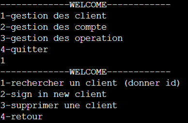
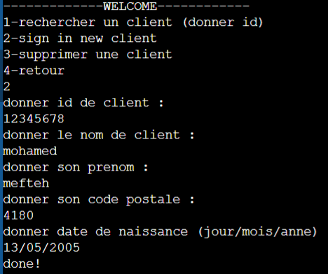
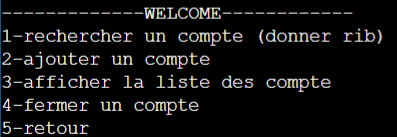
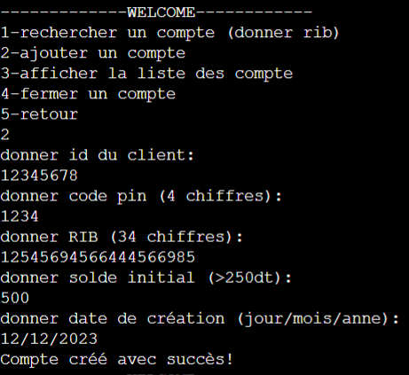
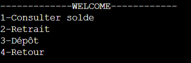
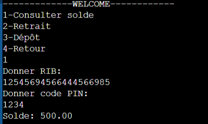

# Client and Account Management System (check 'enoncé 1 (2).jpg' and 'enoncé 2 (2).jpg') to see project description.

This C program implements a client and account management system using linked lists. The system allows for the management of client information and account details, including adding, searching, and deleting clients and accounts.

## Features

- **Client Management**:
  - Add new clients.
  - Search for clients by ID.
  - Delete clients from the system.

- **Account Management**:
  - Add accounts for existing clients.
  - Search for accounts by RIB.
  - Display a list of all accounts.

- **Transaction Operations**:
  - Consult balance.
  - Deposit and withdraw funds from accounts.

## Data Structures

The program utilizes linked lists to manage clients and accounts efficiently:

- **bdclient**: Represents a client node in the linked list, containing client information and a pointer to the next client.
- **bdcompte**: Represents an account node in the linked list, containing account information and a pointer to the next account.

## Code Structure

- **Structures**:
  - `date`: Represents a date with day, month, and year.
  - `client`: Represents a client with attributes such as ID, name, postal code, and date of birth.
  - `compte`: Represents an account with attributes such as client ID, PIN, RIB, balance, and account creation date.
  - `bdclient`: Linked list structure for clients.
  - `bdcompte`: Linked list structure for accounts.

- **Functions**:
  - `init()`: Initializes the linked list.
  - `verif()`: Verifies if a client exists.
  - `ajout_client()`: Adds a new client to the linked list.
  - `supprimer_client()`: Deletes a client from the linked list.
  - `chercher()`: Searches for a client by ID.
  - `ajout_compte()`: Adds an account for a client.
  - `chercher_acc()`: Searches for an account by RIB.
  - `afficher()`: Displays all accounts.
  - `menu()`: Main menu function to navigate through options.

## TRIAL

### Client Interface:

### Account Interface:

### Operation Interface:

